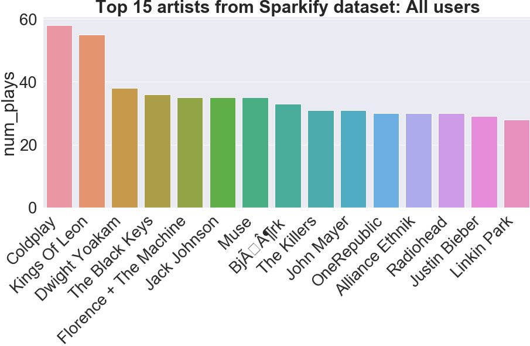

# Data Modeling with Postgres
### Project from Udacity Data Engineering nanodegree
This project places myself as a Data Engineer for a fictional music streaming company called Sparkify. They have raw JSON metadata but no easy way to query the data.  
The goal is to design and create a Postgres database and ETL pipeline to optimize queries on song-play analysis.

### Song JSON data
The first dataset is a subset of real data from the [Million Song Dataset](http://millionsongdataset.com/).  
Each JSON file has metadata for a particular track, with the following fields:
- num_songs, artist_id, artist_latitude, artist_longitude, artist_location, artist_name, song_id, title, duration, year

### Log JSON data  
The second dataset is user songplay log files in JSON format generated by this [event simulator](https://github.com/Interana/eventsim). These simulate activity logs from a music streaming app based on specified configurations.  
Below is an example of what the data in 2018-11-12-events.json looks like:  
  

### Postgres database schema
The image below shows the relational properties of the tables. It is a typical STAR schema, with the fact table (songplays) and 4 dimension tables. It is optimized for analytic queries to answer any questions on user songplay behavior!


### Instructions
1. At the top of **sql_queries.py**, ensure the dbstrings and datapaths are set to the proper Udacity paths (Should already be set correctly). Necessary because I ran this project on my own local Postgres server instead of the Udacity server.  
2. Look through **sql_queries.py** to understand what SQL queries are used throughout the Python scripts.  
3. Run **create_tables.py** to create or reset the Postgres database, and create the tables to be filled by the ETL script
4. Run **etl.py** to read and process the raw JSON files, and load the data into the proper Postgres tables. Also, the sub function *quality_check_data* performs a simple quality check on the tables.
5. Walk through **notebooks/analytic_bashboard.ipynb** to see some basic queries and findings of user preferences based on the data. 

### Extra work completed  
- Used the COPY command instead of INSERT INTO to populate the Postgres tables with improved performance  
- Added a *quality_check_data* function into **etl.py** to make sure the number of table rows in Postgres equals the number of unique IDs from the JSON data  
- Included the **notebooks/analytic_bashboard.ipynb** notebook with some visualizations of some basic queries. See sample query and resulting image below.

### Sample data quality check for the users table
- Total unique user ids in JSON files = 96
- Total rows in the Postgres table = 96
- If equal, check passed!
- Else, reset table in Postgres

### Sample SQL query for the top 15 artists of the Sparkify dataset
```
SELECT a.name AS artist_name, COUNT(*) as num_plays
FROM songplays s
JOIN artists a 
ON s.artist_id = a.artist_id
GROUP BY a.name
ORDER BY num_plays DESC 
LIMIT 15
```
  

### Suggestions to improve project
- Ensure that there are **many** more song matches between the song data and the log data. It doesn't seem helpful to construct the songplays table with only 1 NON NULL row with song information.  
- Include some other fields such as song genre, and beats-per-minute, so we can do more in depth analysis of what user preferences are.